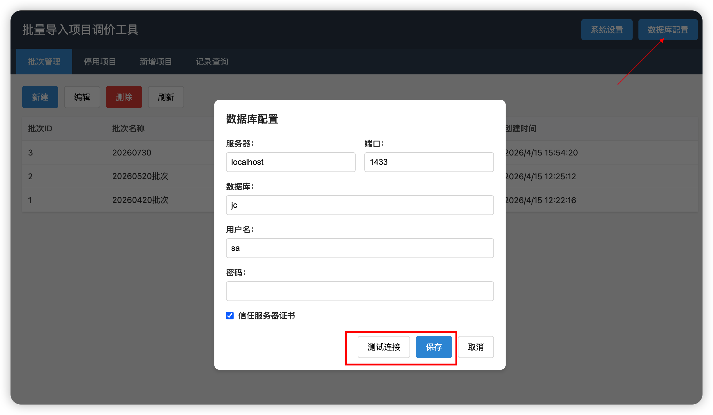
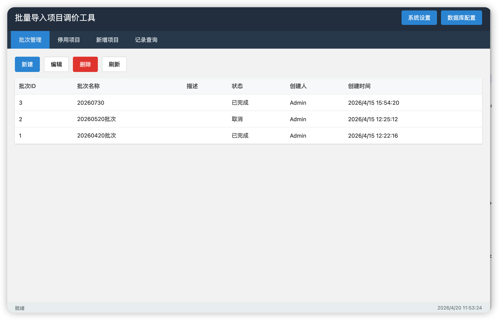

# 批量导入项目调价工具 - 操作说明

## 目录

- [一、软件简介](#一软件简介)
- [二、安装与启动](#二安装与启动)
- [三、主界面说明](#三主界面说明)
- [四、功能模块详细操作](#四功能模块详细操作)
  - [4.1 批次管理](#41-批次管理)
  - [4.2 停用项目](#42-停用项目)
  - [4.3 新增项目](#43-新增项目)
  - [4.4 记录查询](#44-记录查询)
- [五、系统设置](#五系统设置)
  - [5.1 数据库配置](#51-数据库配置)
  - [5.2 必填字段设置](#52-必填字段设置)
- [六、Excel 模板说明](#六 excel-模板说明)
- [七、常见操作流程](#七常见操作流程)
- [八、注意事项](#八注意事项)
- [九、故障排查](#九故障排查)

---

## 一、软件简介

**批量导入项目调价工具**是一款用于批量管理医疗项目价格调整的桌面应用程序。主要功能包括：

- **批次管理**：创建、编辑、删除调价批次
- **停用项目管理**：批量停用现有医疗项目
- **新增项目管理**：批量新增医疗项目
- **执行记录查询**：查看所有调价操作的历史记录

该工具通过 Excel 文件导入数据，支持数据校验、批量保存和执行，确保数据操作的准确性和可追溯性。

---

## 二、安装与启动

### 2.1 安装方式

   - 双击生成的安装程序，按照提示完成安装

### 2.2 启动应用程序

   - 双击桌面上的 "BulkPricingTool" 快捷方式

### 2.3 首次启动配置

首次启动时，打开**数据库配置**对话框，配置以下信息：

- **服务器**：SQL Server 服务器地址（如：`localhost` 或 `192.168.1.100`）
- **端口**：SQL Server 端口（默认：`1433`）
- **数据库**：数据库名称（如：`jc`）
- **用户名**：数据库用户名（如：`sa`）
- **密码**：数据库密码
- **信任服务器证书**：勾选此项可跳过证书验证

配置完成后，点击**测试连接**按钮验证配置是否正确，确认无误后点击**保存**。

---

## 三、主界面说明

### 3.1 界面布局



### 3.2 主要组件

- **标题栏**：显示应用程序名称和快捷按钮
  - **系统设置**：配置必填字段等系统参数
  - **数据库配置**：配置数据库连接信息

- **标签页导航**：切换不同的功能模块
  - **批次管理**：管理调价批次
  - **停用项目**：处理项目停用业务
  - **新增项目**：处理项目新增业务
  - **记录查询**：查看执行历史

- **状态栏**：显示当前状态和系统时间

---

## 四、功能模块详细操作

### 4.1 批次管理

批次是调价操作的基本单位，每次调价操作都需要关联一个批次。

#### 4.1.1 新建批次

1. 点击**批次管理**标签页
2. 点击工具栏的**新建**按钮
3. 在弹出的对话框中输入：
   - **批次名称**：必填，如"2024 年 1 月调价批次"
   - **描述**：可选，对批次的详细说明
4. 点击**确定**保存

#### 4.1.2 编辑批次

1. 在批次列表中选中要编辑的批次
2. 点击**编辑**按钮
3. 修改批次名称或描述
4. 点击**确定**保存

#### 4.1.3 删除批次

1. 在批次列表中选中要删除的批次
2. 点击**删除**按钮
3. 在确认对话框中点击**确定**

> **注意**：删除批次会同时删除该批次下的所有项目数据和执行记录，请谨慎操作！

#### 4.1.4 刷新列表

点击**刷新**按钮重新加载批次列表，确保数据是最新的。

---

### 4.2 停用项目

该模块用于批量停用现有的医疗项目。

#### 4.2.1 操作流程


#### 4.2.2 详细步骤

**步骤 1：选择批次**

- 从批次下拉列表中选择一个已创建的批次

**步骤 2：导入 Excel 文件**

1. 点击**导入 Excel**按钮
2. 选择准备好的 Excel 文件（支持 .xlsx 和 .xls 格式）
3. 系统会自动读取文件内容并显示在表格中

**步骤 3：数据预览与编辑**

- 导入后可以在表格中直接编辑数据
- 确保以下字段正确：
  - **项目编码**：必填
  - **项目名称**：必填
  - **停用原因**：可选

**步骤 4：保存数据**

1. 确认数据无误后，点击**保存**按钮
2. 系统会验证数据完整性
3. 保存成功后会显示保存的记录数

**步骤 5：执行停用**

1. 点击**执行停用**按钮
2. 在确认对话框中点击**确定**
3. 系统会批量执行停用操作
4. 执行完成后查看结果提示

#### 4.2.3 下载模板

点击**下载模板**按钮可以下载标准的 Excel 模板文件，确保数据格式正确。

---

### 4.3 新增项目

该模块用于批量新增医疗项目。

#### 4.3.1 操作流程


#### 4.3.2 详细步骤

**步骤 1：选择批次**

- 从批次下拉列表中选择一个已创建的批次

**步骤 2：导入 Excel 文件**

1. 点击**导入 Excel**按钮
2. 选择准备好的 Excel 文件
3. 系统会自动读取并转换数据

**步骤 3：数据校验与编辑**

导入后系统会自动进行以下校验：

- **字典值转换**：将中文名称转换为系统编码
  - 执行科室
  - 门诊归属
  - 住院归属
  - 病案费用大类
  - 病案费用小类
  - 计价单位

- **数据验证**：
  - 必填字段检查（红色标记表示未填写）
  - 单价不能为负数

**步骤 4：保存数据**

1. 确认数据无误后，点击**保存**按钮
2. 系统会验证所有必填字段
3. 保存成功后会显示保存的记录数

**步骤 5：执行新增**

1. 点击**执行新增**按钮
2. 在确认对话框中点击**确定**
3. 系统会批量执行新增操作
4. 执行完成后查看结果提示

#### 4.3.3 下载模板

点击**下载模板**按钮可以下载标准的 Excel 模板文件。

---

### 4.4 记录查询

查询所有批次调价操作的执行历史记录。

#### 4.4.1 查询条件

- **批次**：选择特定批次，或留空查询全部

#### 4.4.2 执行查询

1. 设置查询条件
2. 点击**查询**按钮
3. 查看查询结果

#### 4.4.3 查询结果

查询结果包含以下信息：

| 字段 | 说明 |
|------|------|
| 日志 ID | 执行记录的唯一标识 |
| 批次 ID | 关联的批次编号 |
| 执行类型 | 停用 或 新增 |
| 执行时间 | 操作执行的具体时间 |
| 状态 | 执行结果状态 |
| 消息 | 详细的执行结果信息 |
| 影响行数 | 执行操作影响的数据行数 |

---

## 五、系统设置

### 5.1 数据库配置

#### 5.1.1 打开配置对话框

点击主界面右上角的**数据库配置**按钮。

#### 5.1.2 配置参数说明

| 参数 | 说明 | 示例 |
|------|------|------|
| 服务器 | SQL Server 服务器地址 | `localhost` 或 `192.168.1.100` |
| 端口 | SQL Server 监听端口 | `1433` |
| 数据库 | 目标数据库名称 | `jc` |
| 用户名 | 数据库登录用户名 | `sa` |
| 密码 | 数据库登录密码 | `YourStrong@Passw0rd` |
| 信任服务器证书 | 是否跳过证书验证 | 勾选/不勾选 |

#### 5.1.3 测试连接

1. 填写完整的数据库配置信息
2. 点击**测试连接**按钮
3. 查看测试结果
   - **连接成功**：显示绿色提示
   - **连接失败**：显示红色错误信息，根据提示检查配置

#### 5.1.4 保存配置

1. 确认连接测试成功
2. 点击**保存**按钮
3. 系统会自动重启数据库连接池

### 5.2 必填字段设置

#### 5.2.1 打开设置对话框

点击主界面右上角的**系统设置**按钮。

#### 5.2.2 配置必填字段

新增项目时，可以自定义哪些字段是必填的。可选字段包括：

- 项目编码
- 项目名称
- 执行科室
- 门诊归属
- 住院归属
- 病案费用大类
- 病案费用小类
- 省单价
- 市单价
- 县单价
- 单价
- 计价单位
- 规格
- 型号

#### 5.2.3 保存设置

1. 勾选需要的必填字段
2. 点击**保存**按钮
3. 系统会立即应用新的验证规则

> **注意**：至少需要选择一个必填字段，否则无法保存。

---

## 六、Excel 模板说明

### 6.1 停用项目模板

#### 模板格式

| 列名 | 是否必填 | 说明 | 示例 |
|------|---------|------|------|
| 项目编码 | 是 | 项目的唯一标识 | `XM001` |
| 项目名称 | 是 | 项目的中文名称 | `血常规检查` |
| 停用原因 | 否 | 停用的具体原因 | `项目合并` |

#### 示例数据

```
项目编码    项目名称        停用原因
XM001      血常规检查      项目合并
XM002      尿常规检查      政策调整
```

### 6.2 新增项目模板

#### 模板格式

| 列名 | 是否必填 | 说明 | 示例 |
|------|---------|------|------|
| 项目编码 | 是 | 项目的唯一编码 | `XM003` |
| 项目名称 | 是 | 项目的中文名称 | `CT 扫描` |
| 执行科室 | 否 | 执行科室名称或编码 | `放射科` |
| 门诊归属 | 否 | 门诊三级项目分类 | `治疗费` |
| 住院归属 | 否 | 住院三级项目分类 | `检查费` |
| 病案费用大类 | 否 | 费用大类分类 | `检查费` |
| 病案费用小类 | 否 | 费用小类分类 | `CT 检查` |
| 省单价 | 否 | 省级定价 | `150.00` |
| 市单价 | 否 | 市级定价 | `140.00` |
| 县单价 | 否 | 县级定价 | `130.00` |
| 单价 | 否 | 价格 | `120.00` |
| 计价单位 | 否 | 价格单位 | `次` |
| 规格 | 否 | 项目规格描述 | `64 排` |
| 型号 | 否 | 设备型号 | `GE-LightSpeed` |

> **说明**：标有 * 的字段为系统默认必填字段，可通过系统设置调整。

#### 示例数据

```
项目编码    项目名称      执行科室    门诊归属    住院归属    病案费用大类    病案费用小类    省单价    市单价    县单价    单价    计价单位    规格    型号
XM003      CT 扫描      放射科      治疗费        检查费        检查费        CT 检查        150      140      130      120      次        64 排   GE-LightSpeed
XM004      MRI 检查      放射科      治疗费        检查费        MRI 检查       300      280      260      250      次        3.0T    Siemens
```

### 6.3 数据导入注意事项

1. **文件格式**：支持 .xlsx 和 .xls 格式
2. **表头要求**：第一行必须是列名（中文或英文均可）
3. **数据行**：从第二行开始填写实际数据
4. **空行处理**：系统会自动过滤空行
5. **编码转换**：
   - **导入时系统会尝试将中文名称转换为系统编码**
   - 如果转换失败，系统会显示警告信息
   - 建议在导入前确认字典值在系统中存在

---

## 七、常见操作流程

### 7.1 完整的新增项目流程

```
1. 启动应用程序
   ↓
2. 配置数据库连接（首次使用）
   ↓
3. 创建新批次
   ↓
4. 切换到"新增项目"标签页
   ↓
5. 选择刚创建的批次
   ↓
6. 下载并填写 Excel 模板
   ↓
7. 导入 Excel 文件
   ↓
8. 检查并编辑数据
   ↓
9. 保存数据
   ↓
10. 执行新增操作
   ↓
11. 查看执行结果
   ↓
12. 在"记录查询"中查看历史
```

### 7.2 完整的停用项目流程

```
1. 启动应用程序
   ↓
2. 创建新批次（或使用已有批次）
   ↓
3. 切换到"停用项目"标签页
   ↓
4. 选择批次
   ↓
5. 下载并填写 Excel 模板
   ↓
6. 导入 Excel 文件
   ↓
7. 检查并编辑数据
   ↓
8. 保存数据
   ↓
9. 执行停用操作
   ↓
10. 查看执行结果
```

### 7.3 批量操作最佳实践

1. **分批处理**：建议每个批次处理 100-500 条记录，避免单次操作数据量过大
2. **数据备份**：执行前务必备份 Excel 源文件
3. **测试验证**：首次使用时，先用少量数据测试完整流程

---

## 八、注意事项

### 8.1 数据安全

- ⚠️ **执行前确认**：执行操作是不可逆的，请务必在執行前仔细核对数据
- ⚠️ **定期备份**：建议定期备份数据，防止数据丢失
- ⚠️ **权限管理**：数据库账号应具有适当的操作权限，避免使用过高权限账号

### 8.2 数据质量

- ✓ **必填字段**：确保所有必填字段都已填写
- ✓ **数据格式**：价格字段必须是数字，不能包含特殊字符
- ✓ **字典值**：科室、属性等字段必须在系统字典中存在
- ✓ **唯一性**：项目编码在系统内应保持唯一

### 8.3 系统性能

- **并发控制**：避免多人同时操作同一批次
- **数据量限制**：单次导入建议不超过 1000 条记录
- **网络环境**：确保与数据库服务器的网络连接稳定

### 8.4 异常处理

- **执行失败**：查看执行记录中的错误信息，根据提示修正数据后重新执行
- **连接中断**：检查数据库配置和网络连接，重新连接后继续操作
- **数据异常**：立即停止操作，联系管理员检查数据完整性

---

## 九、故障排查

### 9.1 常见问题及解决方案

#### 问题 1：数据库连接失败

**现象**：测试连接时提示"连接失败"

**解决方案**：
1. 检查服务器地址和端口是否正确
2. 确认数据库服务是否运行
3. 验证用户名和密码是否正确
4. 检查防火墙设置，确保端口可访问
5. 尝试勾选"信任服务器证书"

#### 问题 2：导入 Excel 失败

**现象**：导入文件时提示错误

**解决方案**：
1. 检查文件格式是否为 .xlsx 或 .xls
2. 确认文件没有被其他程序占用
3. 检查表头格式是否符合要求
4. 确保文件内容不是空的

#### 问题 3：字典值转换失败

**现象**：导入后提示某些字段未能正常转换

**解决方案**：
1. 确认填写的字典值在系统中存在
2. 检查是否有拼写错误或多余空格
3. 使用系统提供的字典查询功能确认正确值
4. 直接填写编码而非名称

#### 问题 4：执行操作失败

**现象**：点击执行按钮后提示失败

**解决方案**：
1. 查看错误提示信息
2. 检查数据是否已保存
3. 确认数据是否符合业务规则
4. 查看执行日志获取详细错误信息
5. 联系数据库管理员检查数据库状态

### 9.2 获取帮助

如果遇到无法解决的问题，请收集以下信息并联系技术支持：

1. **错误截图**：完整的错误提示信息
2. **日志文件**：最近的 server.log 和 electron.log
3. **操作步骤**：导致问题的具体操作步骤
4. **环境信息**：操作系统版本、数据库版本

---

**文档结束**

如对本操作说明有任何疑问或建议，请联系开发团队。
